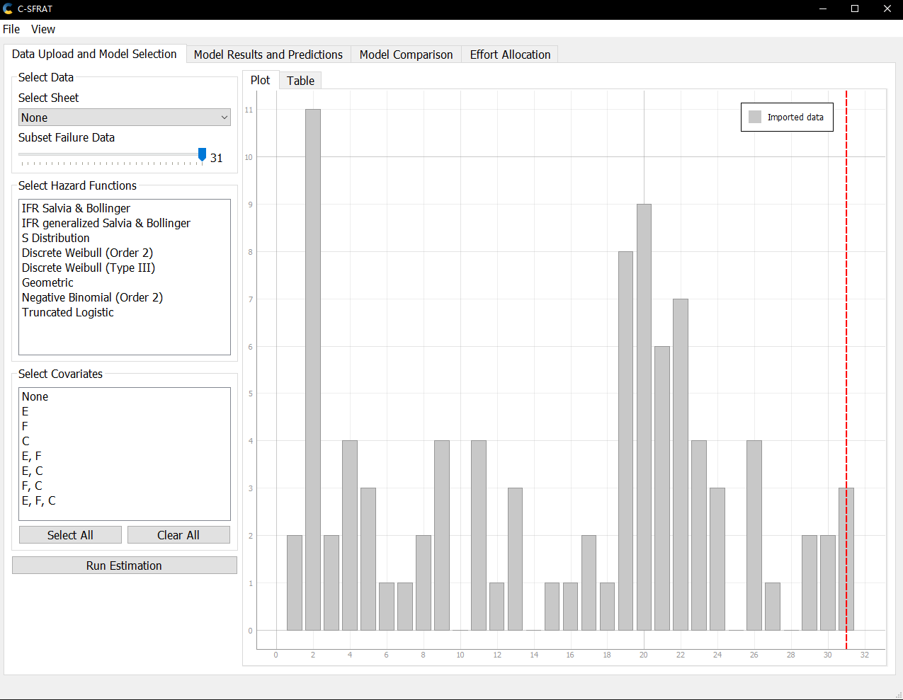
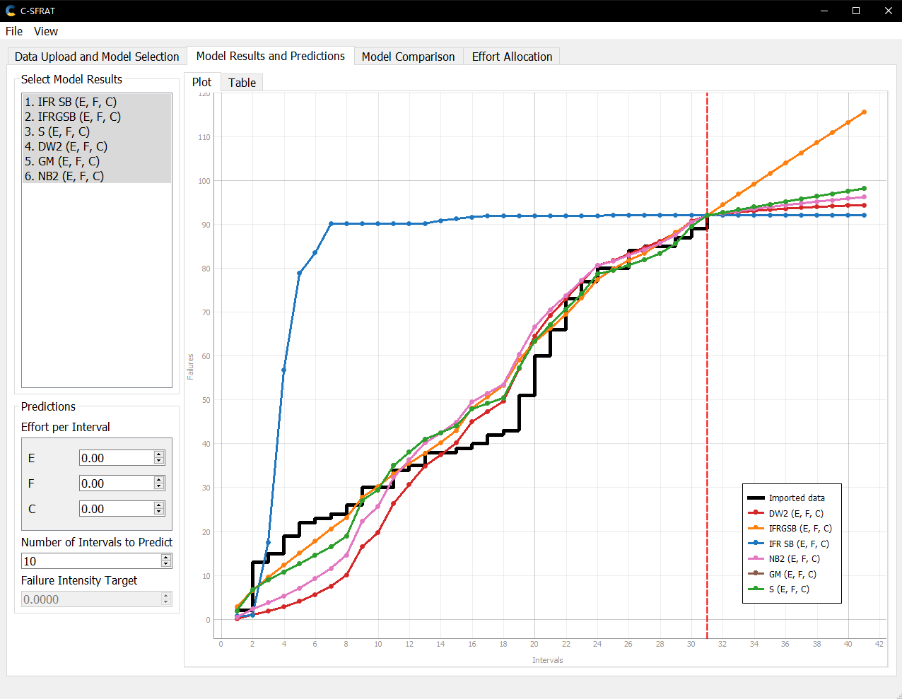
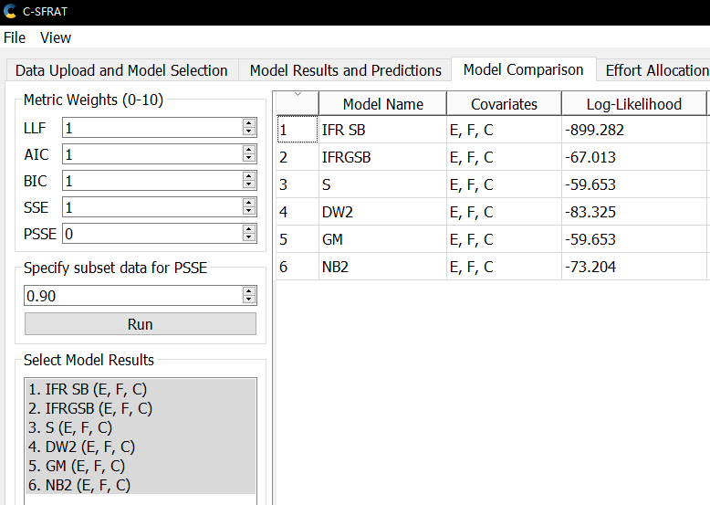
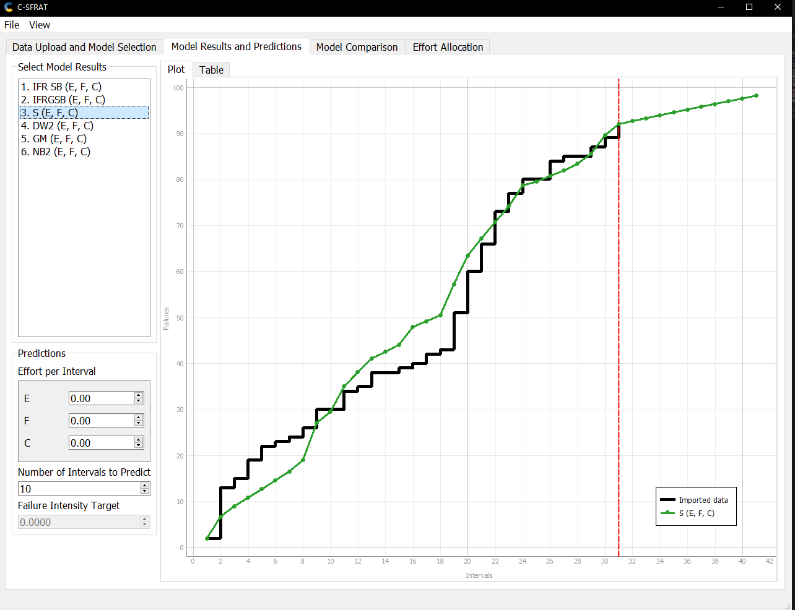
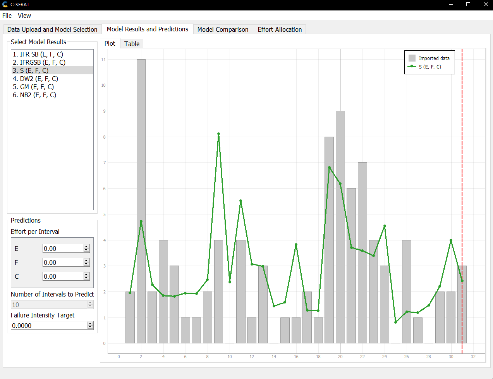

**SENG 438- Software Testing, Reliability, and Quality**

**Lab. Report \#5 – Software Reliability Assessment**

| Group \#:      |     |
| -------------- | --- |
| Student Names: |     |
|                |     |
|                |     |
|                |     |

# Introduction

This assignment aims to test our ability to check the reliability of the system using the given failure data. In this assignment, we can practise the use of reliability tools and two reliability tests: reliability growth testing and RDC.

# Assessment Using Reliability Growth Testing

The Failure intensity graph. The failure intensity does not a have significant drop as the time goes.

The graphs generated with the imported data and all three covariates. Intervals to predict is set to 10.

By the comparison, S Distribution and Geometric graphs have the highest and the same log-likelihood. Since they are exactly the same result, for the simplicity, S graph will be picked to analyze.

In the 10 intervals of prediction, the failure rate slightly drops.

In the view of failure intensity, the given failure data set does not demonstrate a strong reliability growth.

# Assessment Using Reliability Demonstration Chart

In order to make the given failture data fit the reliability demonstration chart, all the failure data are divided by 10.

When the maximum accpetable number of failures is set to 0.4, the FIO is 0.4 failures per 1 call. The SUT becomes accpetable because the incremented failure counts don't exceed the maximum accptable number of failure which is 0.4.

When we decrease the maximum acceptable number of failures to 0.2, the observed failures all stay in the continue region. This means that we need more failures data to test the system's reliability.

When we set the maximum number of failures to 0.07, the FIO is 0.07 failures per 1 call and the observed failures all stay in the reject region. The SUI becomes unaccpetable because the incremented failure counts exceed 0.07.

From what we observed, we know that the maximum acceptable number of failures affects the RDC. The smaller maximum acceptable number of failures, the higher possibility that the failure data will be unacceptable.

# Comparison of Results

# Discussion on Similarity and Differences of the Two Techniques

# How the team work/effort was divided and managed

For part I, Zheng Chen and Rui Guan used Windows system to do the reliability growth testing. For part II, Weitao Wu and Brian Chen did the RDC testing using the RDC.xls.

# Difficulties encountered, challenges overcome, and lessons learned

When first time using the RDC.xls, we were confused about where and how to input the failure data. We divided the failture data by 10 so that the failure data would fit the RDC. Then, we firgured out the maximum acceptable number of failure is the key to affect the RDC. Through the RDC testing, we know that the RDC testing is very useful to test the reliability of a system by regulating the maximum acceptable number of failures.

# Comments/feedback on the lab itself
This lab is overall great. It provides chance for us to do the realiability testing. But the instruction is not clear enough at some points which is needed to be improved.
